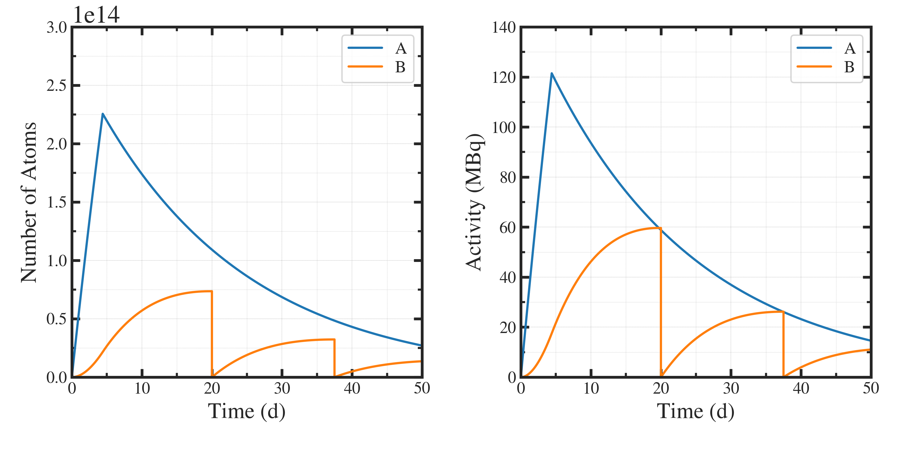

##############################################################
製造量 時間変化の解析
##############################################################

=========================================================
解析解 ( 照射製造核種 [A] / [B] ) のまとめ
=========================================================

.. math::
   
   [A] &= [A]_0 e^{ -\lambda_1 (t-t_0) } + \dfrac{Y}{\lambda_1} [ 1 - e^{ -\lambda_1 (t-t_0) } ] \\
   [B] &= [B]_0 e^{ - \lambda_2 (t-t_0) } + \dfrac{ \lambda_1 [A]_0 - Y }{ \lambda_2 - \lambda_1 } \left[ e^{ - \lambda_1 ( t-t_0 ) } - e^{ - \lambda_2 (t-t_0) } \right] + \dfrac{ Y }{ \lambda_2 } ( 1 - e^{ - \lambda_2 ( t-t_0 ) } )

Beam on/offは Y>0, Y=0 に現れる．

=========================================================
製造量解析
=========================================================

---------------------------------------------------------
製造量解析コード ( settings.jsonc )
---------------------------------------------------------

.. literalinclude:: cnf/settings.jsonc
   		    :language: javascript

---------------------------------------------------------
製造量解析コード ( estimate__time_vs_yield.py )
---------------------------------------------------------

.. literalinclude:: pyt/estimate__time_vs_yield.py
   		    :language: python

---------------------------------------------------------
実行結果
---------------------------------------------------------

