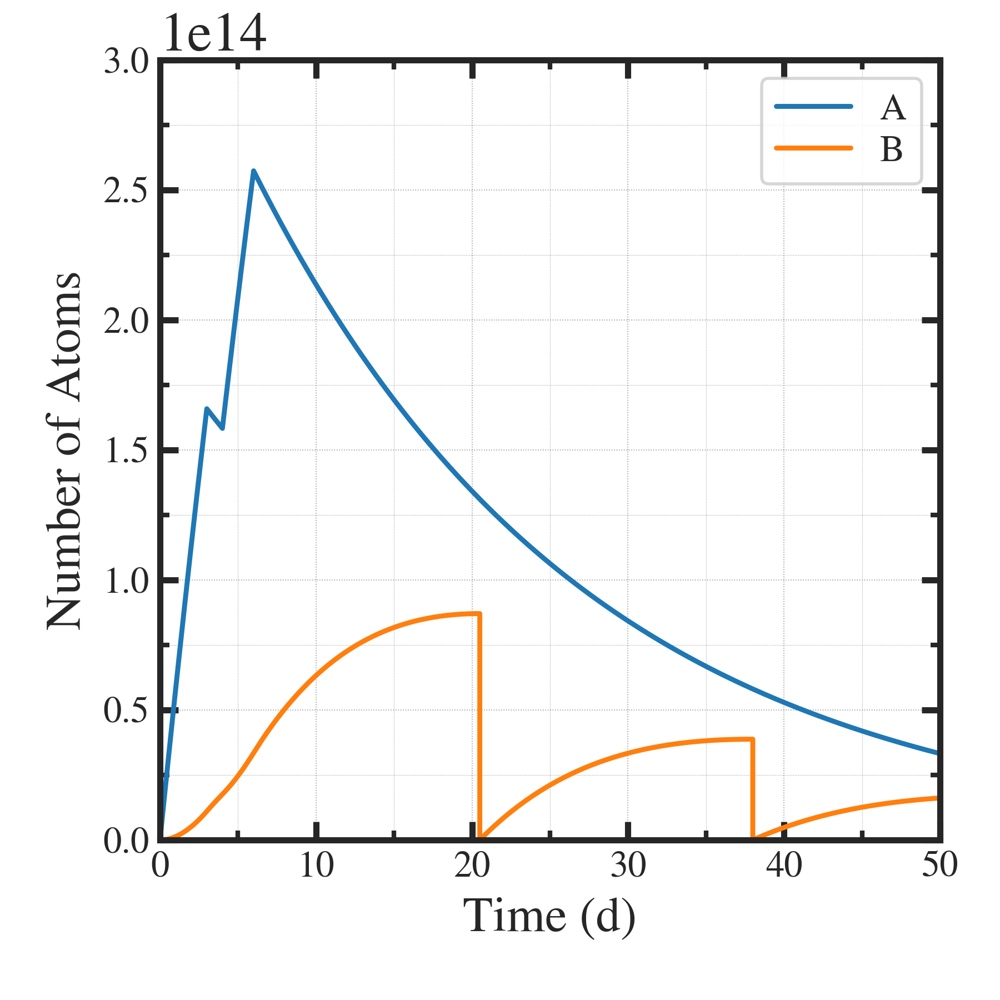
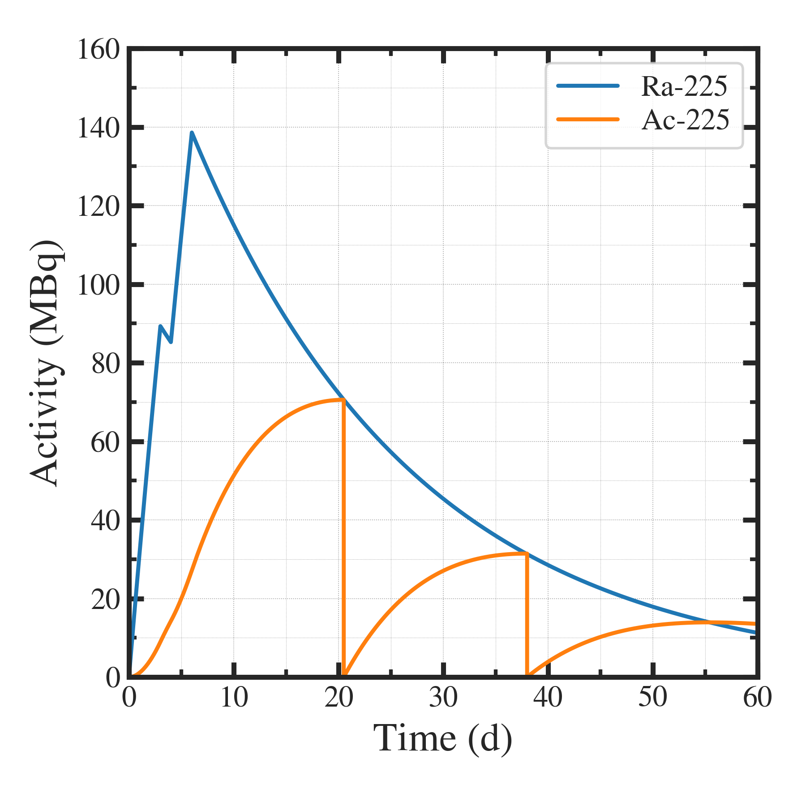

##############################################################
照射製造時の製造量の時間変化について（３）
##############################################################

=========================================================
Ra-225/Ac-225の照射製造の例について
=========================================================

---------------------------------------------------------
計算条件 ( パラメータファイル )
---------------------------------------------------------

.. literalinclude:: dat/settings_20240901.json

                    
---------------------------------------------------------
計算結果 ( 原子数 )
---------------------------------------------------------

---------------------------------------------------------
計算結果 ( 放射能 )
---------------------------------------------------------

