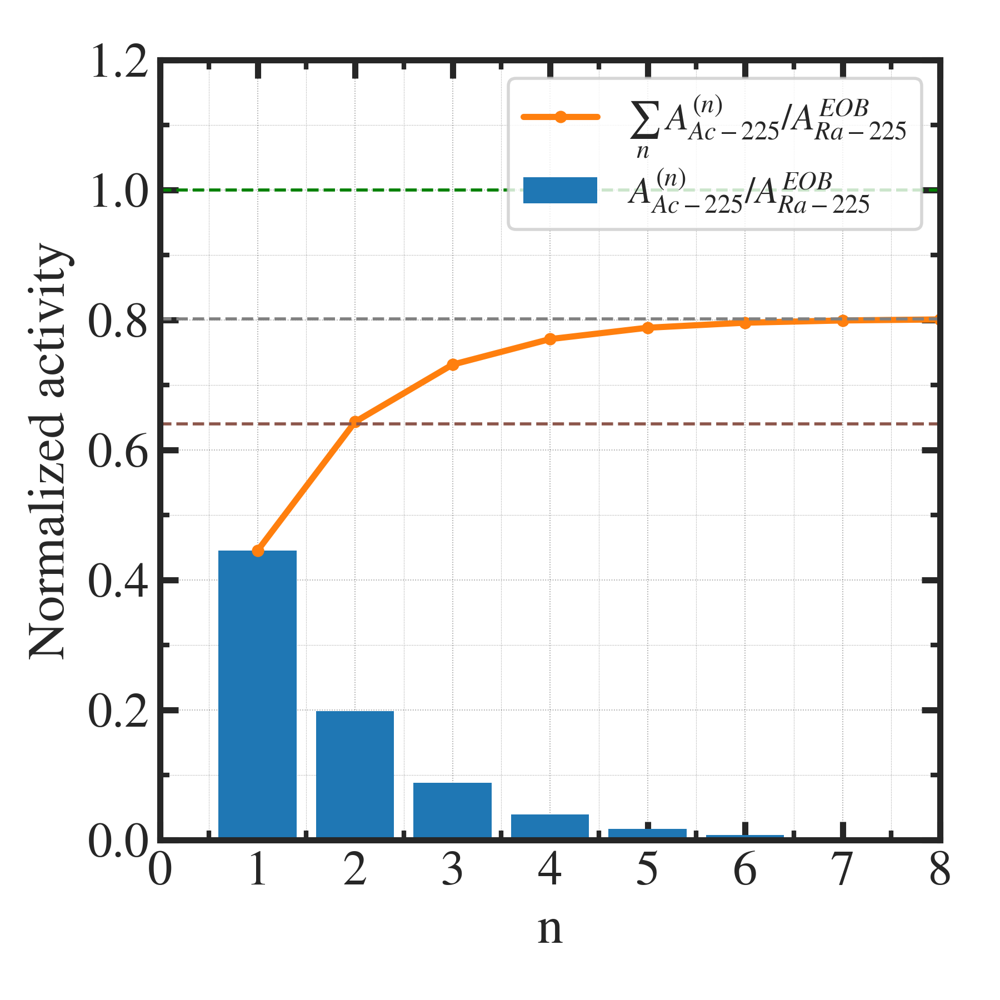

##############################################################
照射製造時の製造量の時間変化について（４）
##############################################################

=========================================================
ミルキングによる製造量の限界について
=========================================================

ｎ回目の分離精製によって得られる製造量は、下記の通り．

.. math::

   A^{(n)}_{Ac-225} = \dfrac{ \lambda_2 }{ \lambda_2 - \lambda_1 } 
   \left[ e^{- \lambda_1 T_{max} } - e^{- \lambda_2 T_{max} } \right]
   e^{- (n-1) \lambda_1 T_{max} } A^{EOB}_{Ra-225}

   
無限等比級数の和を計算すると、無限回の分離精製で得られる合計量は、

.. math::

   A^{total}_{Ac-225} &= \dfrac{ \lambda_2 }{ \lambda_2 - \lambda_1 } 
   \left[ e^{- \lambda_1 T_{max} } - e^{- \lambda_2 T_{max} } \right]
   \dfrac{ 1 }{ 1- e^{- \lambda_1 T_{max} } } A^{EOB}_{Ra-225} \\
   &= 0.802 A^{EOB}_{Ra-225}

   
となり、EOBの親核種製造量の約80％が最大量となる．

---------------------------------------------------------
グラフ
---------------------------------------------------------

|

            

約80％の量は、2回の分離精製で得られる．あまり回数を重ねる意味はない．
            
---------------------------------------------------------
コード
---------------------------------------------------------

.. literalinclude:: pyt/limit_of_milking.py
   		    :language: python
