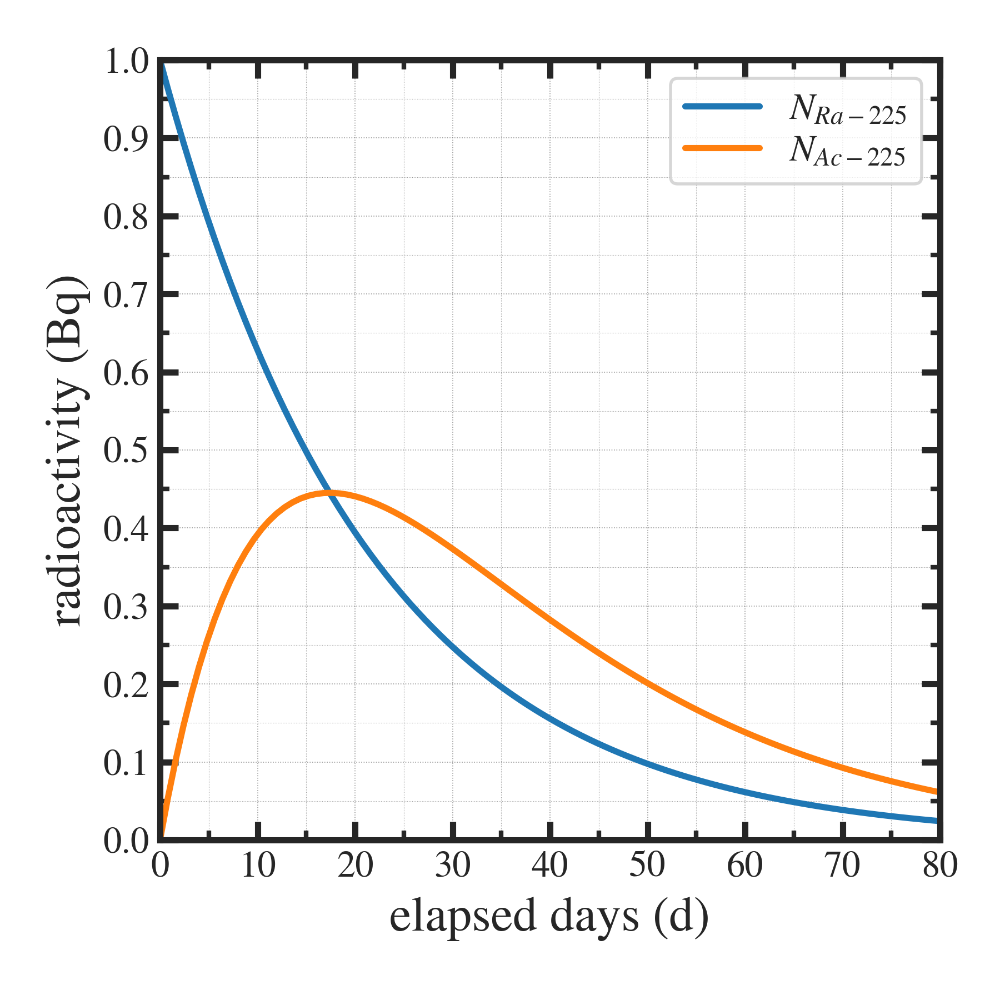

##############################################################
放射平衡
##############################################################

=========================================================
放射平衡とは．
=========================================================

*  :red:`放射平衡` とは、特定の放射性物質が  :blue:`生成と崩壊のバランスを取る状態` を指す．
* 単発の放射性崩壊は、ある放射性同位体Aの崩壊は、別の同位体Bの生成となる．
* もし、Bが不安定核であった場合、  :blue:`連発１次崩壊` となり、Bの存在量は、 :blue:`Bの生成率（＝Aの崩壊率）とBの崩壊率に支配` される．
* このような、特定の放射性同位体の生成と崩壊が釣り合っており、放射崩壊が安定した状態を、  :red:`放射平衡` とよぶ．

=========================================================
崩壊定数と半減期
=========================================================

崩壊定数と半減期は次の関係をもつ．

.. math::

   \lambda = \dfrac{ln2}{T} \sim \dfrac{0.693}{T}

   
=========================================================
連発１次崩壊 
=========================================================

---------------------------------------------------------
基本解
---------------------------------------------------------

同位体が、A→B→C と、放射性崩壊する場合を考える．Aの原子数を :math:`[A]` と表し、A,B の半減期、崩壊定数をそれぞれ、 :math:`T_1, \lambda_1` 及び :math:`T_2, \lambda_2` とすれば、原子数の支配方程式は、

.. math::

   \dfrac{ d[A] }{ dt } &= - \lambda_1 [A] \\
   \dfrac{ d[B] }{ dt } &= + \lambda_1 [A] - \lambda_2 [B]

   
とかける．Aについての式は、直接積分可能であり、その結果をBについての式に代入し、斉次方程式より変数分離法を用いて解けば、

.. math::

   [A] &= [A]_0 e^{ - \lambda_1 t } \\
   [B] &= \dfrac{ \lambda_1 }{ \lambda_2 - \lambda_1 } [A]_0 \left[ e^{ - \lambda_1 t } - e^{ - \lambda_2 t } \right]

または、
   
.. math::

   N_A &= \lambda_1 [A] = \lambda_1 [A]_0 e^{ - \lambda_1 t } = N_{A0} e^{ - \lambda_1 t } \\
   N_B &= \lambda_2 [B] = \dfrac{ \lambda_2 }{ \lambda_2 - \lambda_1 } N_{A0} \left[ e^{ - \lambda_1 t } - e^{ - \lambda_2 t } \right]

となる．

---------------------------------------------------------
例： Ra-225 → Ac-225
---------------------------------------------------------

* (e.g.) Ra-225 ( T1=14.9 d ) と Ac-225 ( T2=9.9 d ) の場合

  
---------------------------------------------------------
プロットプログラム
---------------------------------------------------------

.. literalinclude:: radiative_equilibrium__basic.py
   		    :language: python

---------------------------------------------------------
収量最大の時刻
---------------------------------------------------------

* 上式は、時間とともに B が生成され、ある時刻で最大値となり、無限時間経過時点で B の存在量はゼロへと近づく．Bの存在量が最大となる時刻 :math:`T_{max}` は、 :math:`d[B]/dt=0`  より、以下とかける．

.. math::

   T_{max} &= \dfrac{1}{\lambda_1-\lambda_2} ln \left[ \dfrac{\lambda_1}{\lambda_2} \right]

* (e.g.) Ra-225 ( T1=14.9 d ) と Ac-225 ( T2=9.9 d ) の場合

.. math::

   \lambda_1 = 5.4 \times 10^{-7} &, \ \ \ \lambda_2 = 8.1 \times 10^{-7} \\
   T_{max} = \dfrac{1}{ 5.4 \times 10^{-7} - 8.1 \times 10^{-7} } \ &ln \left[ \dfrac{ 5.4 \times 10^{-7} }{ 8.1 \times 10^{-7} } \right] = 17.4 (d)

* このときの初期Ra-225量からみたAc-225製造量

.. math::

   [B]/[A]_0 = \dfrac{ \lambda_1 }{ \lambda_2 - \lambda_1 } \left[ e^{ - \lambda_1 t } - e^{ - \lambda_2 t } \right]

または、

.. math::

   N_B / N_{A0} = \dfrac{ \lambda_2 [B] }{ \lambda_1 [A]_0}  = \dfrac{ \lambda_2 }{ \lambda_2 - \lambda_1 } \left[ e^{ - \lambda_1 t } - e^{ - \lambda_2 t } \right] = 0.445 = 44.5 (\%)

崩壊開始時点のRa-225放射能に対して、 :blue:`44 (%)` 程度のAc-225が得られる．
