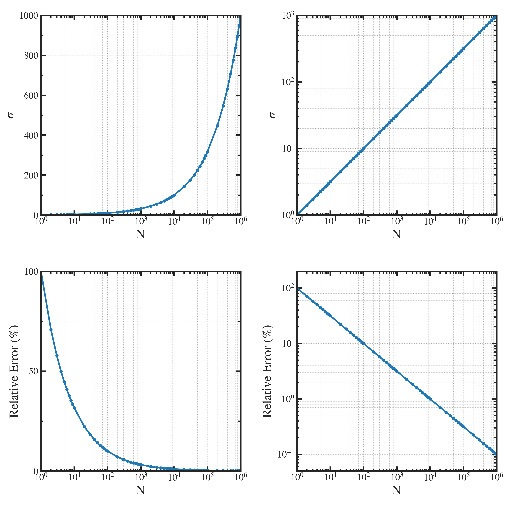

##############################################################
放射線計測における相対誤差
##############################################################

=========================================================
放射線計測におけるカウントと統計学
=========================================================

---------------------------------------------------------
カウント
---------------------------------------------------------

* 放射線計測では、検出器が一定の時間内で放射線イベント（例：光子や粒子の検出）を数える．
* 計測された放射線イベント数を  :red:`「計数（カウント）」` と呼ぶ．
* カウントと相対誤差は、  :blue:`統計学` によって規定される．

---------------------------------------------------------
放射線計測とポアソン分布
---------------------------------------------------------

* ポアソン分布は、稀な事象がランダムに発生する場合の統計的な分布．
* カウントが十分に大きい場合にはガウス分布（正規分布）に収束する（大数の法則）．
* ポアソン分布の特性により、カウントが増加すれば相対誤差は減少する．

|
  
=========================================================
カウントと相対誤差率の関係
=========================================================

* ポアソン分布からN回のイベント（放射線計測）が生じた際、測定値(イベント数) :math:`N` の標準偏差 :math:`\sigma` 、及び、相対誤差率 :math:`E` は、

.. math::

   \sigma = \sqrt{ N }

.. math::

   E = \dfrac{ \sqrt{ N } }{ N }

|

=========================================================
相対誤差の特性
=========================================================

---------------------------------------------------------
カウント数に対する誤差特性
---------------------------------------------------------

|

---------------------------------------------------------
誤差特性(数値)
---------------------------------------------------------

.. csv-table:: **Error v.s. counts**
   :header: "Counts", "Standard Deviation", "Relative Error (%)"
   :widths: 10, 10, 10
   :width:  600px
   
   "1 (1e0)", "1", "100"
   "100 (1e2)", "10", "10"
   "1000 (1e3)", "31.6", "3.16"
   "3000 (3e3)", "54.7", "1.83"
   "10000 (1e4)", "100", "1.0"
   "1000000 (1e6)", "1000", "0.1"

|

.. note::

   * 3000 カウントで、 2 % 以下 ( 粗い測定で目指す )
   * 10000 (1e4) カウントで、1 %
   * 1000000 (1e6) カウントで、 0.1 %  ( 精密な測定で目指す )

|
     
---------------------------------------------------------
（参考） 表示プログラム
---------------------------------------------------------

.. literalinclude:: pyt/statistic_error.py
   		    :language: python

