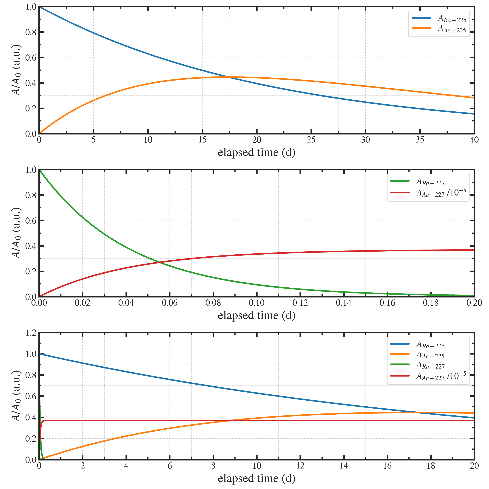

##############################################################
半減期の違いを利用した不純物の除去 (Ac-225/Ac-227) (1)
##############################################################

=========================================================
連発一次反応 (Ra-225/Ra-227)
=========================================================

* 下記、時定数の異なる2つの崩壊反応の放射能を図示する．

  - Ra-225 → Ac-225 + e- + ν
  - Ra-227 → Ac-227 + e- + ν

    
=========================================================
計算
=========================================================

---------------------------------------------------------
コード
---------------------------------------------------------

.. literalinclude:: pyt/remove__Ac227byEarlyFiltering.py
   		    :language: python

---------------------------------------------------------
グラフ
---------------------------------------------------------

---------------------------------------------------------
コメント
---------------------------------------------------------

* 図示の通り、不純物はすぐ割れているのに対し、製造対象はなかなか割れない．
* 製造のビーム照射終了後に、すぐに１回目の分離をすることで、Ra-228由来のAc-227を低減できる．
