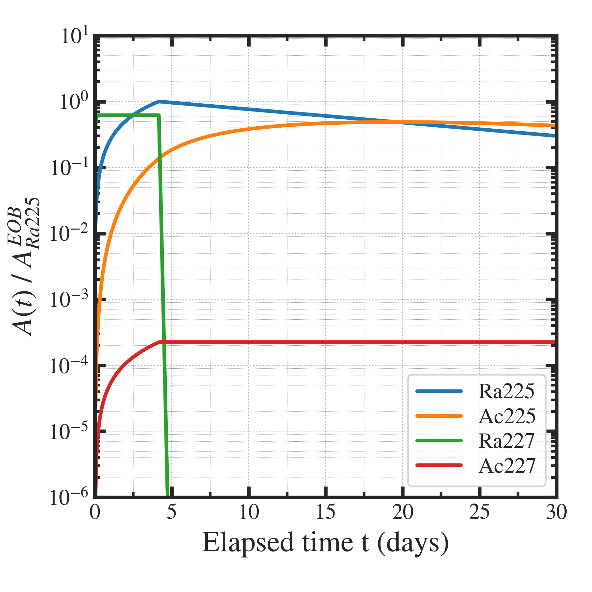
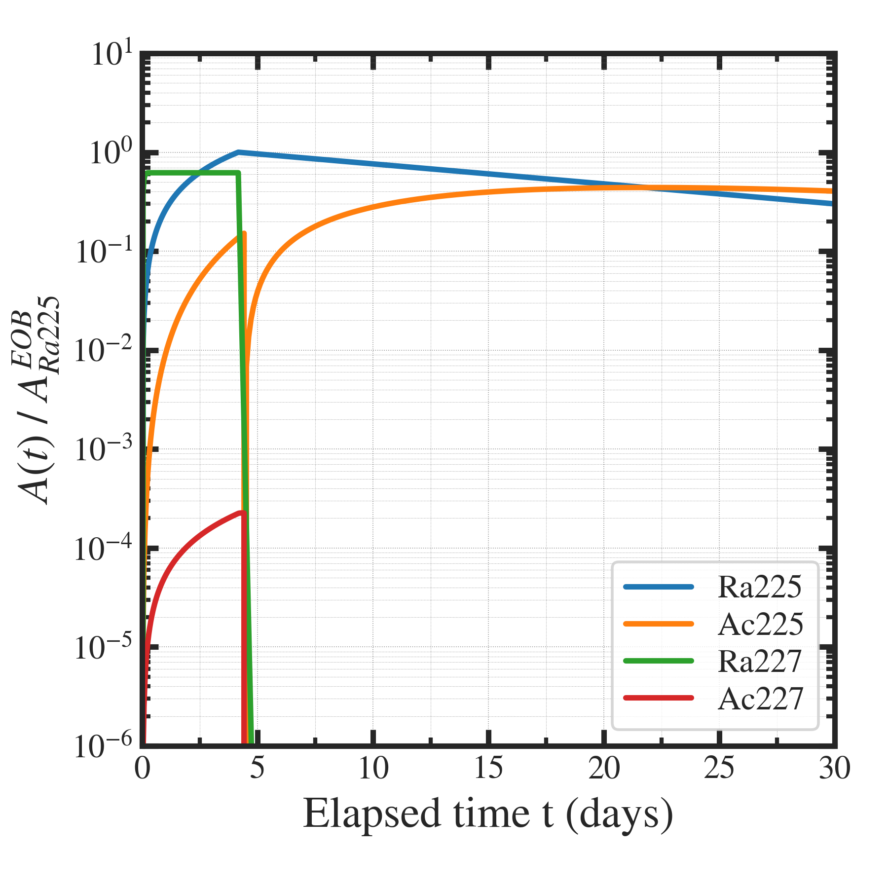

##############################################################
半減期の違いを利用した不純物の除去 (Ac-225/Ac-227) (3)
##############################################################

=========================================================
グラフ
=========================================================

---------------------------------------------------------
不純物除去を実施しないケース
---------------------------------------------------------

|

|

---------------------------------------------------------
不純物除去を実施するケース
---------------------------------------------------------

|

|

=========================================================
考察
=========================================================

---------------------------------------------------------
不純物核種 Ac-227 の低減
---------------------------------------------------------

* 不純物分離は、100 h 照射後、6時間後に実施．
* 低減操作しない場合．
  
  + Ac-227は 102 (Bq), Ac-225は、220 (kBq) なので、463 (ppm)
  
* 分離精製効率が 100 (%) の場合．

  + 分離精製したときに残っているRa-227は、789 (Bq) / 451 (kBq) ( 1749 ppm ) ( Ra-227 / Ra-225 )．
  + これが崩壊して生じるAc-227は、2.94e-3 (Bq)． 0.00651 (ppm) = 6.51 (ppb) ( Ac-227 / Ra-225 )
  + Ac-225基準だと、2.94e-3 (Bq) / 2.20e5 (Bq) = 0.0134 (ppm) = 13.4 (ppb). 
  
* 分離効率が 99.9 (%) の場合．
  
  + Ra-227 が崩壊して生じるAc-227は、2.94e-3 (Bq)
  + Ac-227 の取り切れなかった分は、102 (Bq) の 0.01 (%) として、1.02e-1 (Bq)． 合計、1.05e-1 (Bq)
  + Ra-225基準で、 1.05e-1 / 4.51e5 = 2.33e-7 = 0.233 (ppm)
  + Ac-225基準で、 1.05e-1 / 2.20e5 = 4.77e-7 = 0.477 (ppm)

* Ra/Acの分離効率が 99.9 (%) （容易）であれば、1 (ppm) 以下にすることができる．

---------------------------------------------------------
Ac-225のロス
---------------------------------------------------------

* 通常生成時のAc-225は、2.20e5 (Bq)．
* 低減操作時のAc-225は、1.99e5 (Bq)．
* 比率は、1.99e5 / 2.20e5 * 100 = 90.4 (%)

* ロス 10 (%) 程度を許容すれば、Ac-227含有量を 1/1000 以下 に低減することができる．
