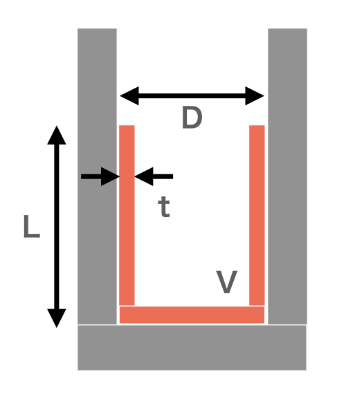
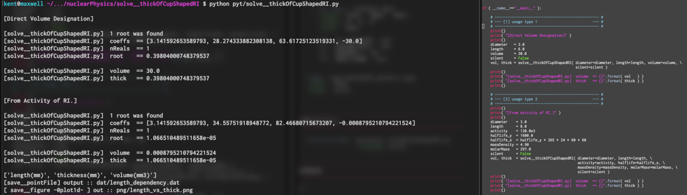
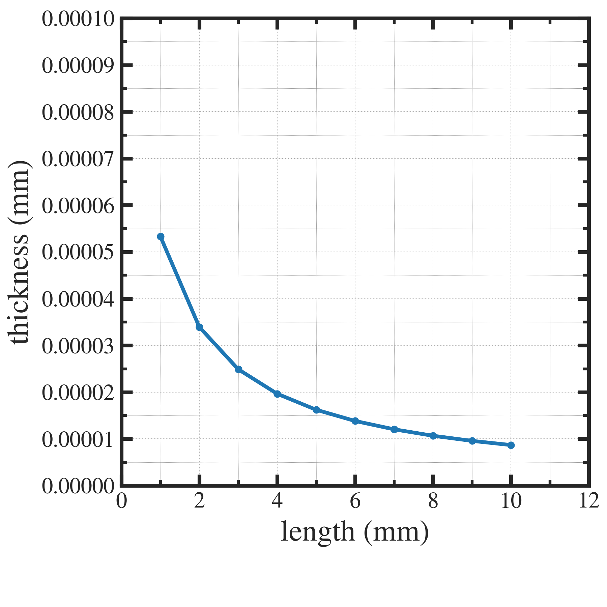

##############################################################
カップ形状に分布したRI試料の厚みを求める計算
##############################################################

=========================================================
試料の厚みを計算
=========================================================

---------------------------------------------------------
極薄い試料の平均厚みを放射能から換算したい
---------------------------------------------------------

* 半減期T より崩壊定数 λ を求め、放射能 A から原子数 N がわかる
* 質量密度ρ、モル質量M、アボガドロ数NAより、体積あたりの原子数が計算可能．
* 上記、２つより、放射能Aから試料体積Vが計算可能．
* ある試料体積Vが分布して存在するとき、その平均厚みtがどの程度かを見積もれる．

  + 試料の平均厚みを指定してモンテカルロ計算が可能．

    
---------------------------------------------------------
半減期Tより崩壊定数λ
---------------------------------------------------------

.. math::

   \lambda = \dfrac{ ln2 }{ T }

   
---------------------------------------------------------
放射能Aより原子数Nを導出
---------------------------------------------------------

.. math::

   A &= \lambda N \\
   N &= A / \lambda = AT / ln2

   
---------------------------------------------------------
体積あたり原子数密度 n 
---------------------------------------------------------

.. math::

   n &= \dfrac{ N_A } { M / \rho } \ \ [ ( atoms/mol ) / ( (g/mol) / (g/cm3) ) ] \\
     &= \dfrac{ \rho N_A }{ M } \ \ [ atoms/cm3 ]

---------------------------------------------------------
放射能A の体積は
---------------------------------------------------------

.. math::

   V = \dfrac{N}{n} = \dfrac{ AT }{ ln2 } \dfrac{ M }{ \rho N_A } \ \ [ cm^3 ]

   
=========================================================
カップ型のモデル形状
=========================================================

* 試験管などで蒸発乾固した際に、カップ内側に均一厚みの試料層が形成されていることを考える．

  + パラメータは下記

    .. csv-table:: **パラメータ**
       :header: "記号", "意味", "単位"
       :widths: 10, 10, 10
       :width:  500px
       
       "D", "カップの直径", "mm"
       "L", "試料層の高さ", "mm"
       "t", "試料厚み", "mm"
       "V", "試料の体積", "mm3"

       
---------------------------------------------------------
計算プログラム
---------------------------------------------------------

.. literalinclude:: pyt/solve__thickOfCupShapedRI.py
   		    :language: python

---------------------------------------------------------
計算結果
---------------------------------------------------------

            
---------------------------------------------------------
試料厚さの試料広がり長依存性
---------------------------------------------------------

|

.. note::

   試料長さと、試料厚みに、上記の値を適用して、シミュレーションすれば、与えられた放射能の物質がカップ状に広がって分布した場合に、どの程度、入射するかを計算できる．
