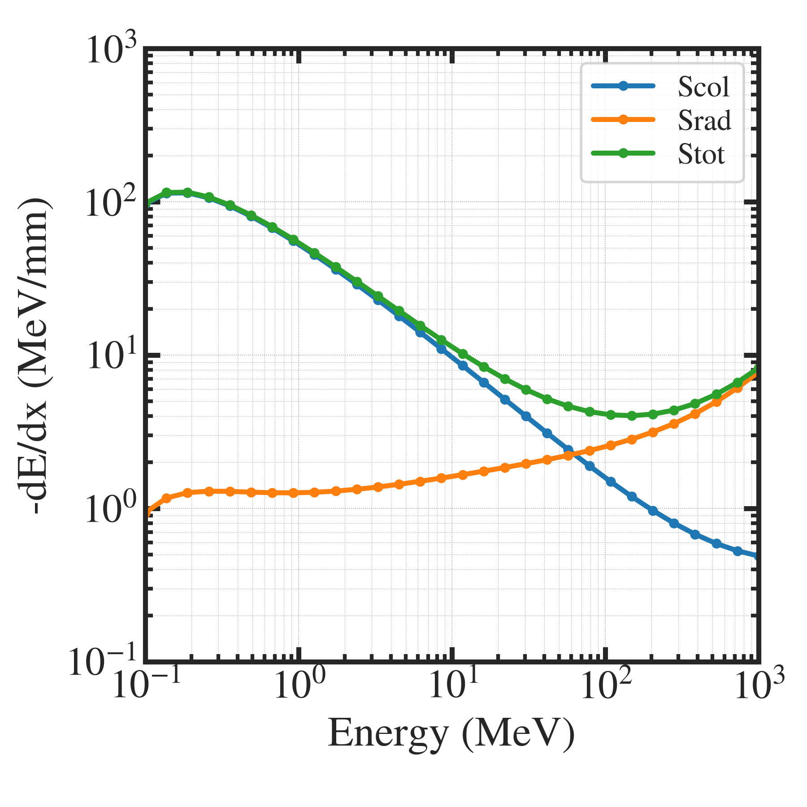
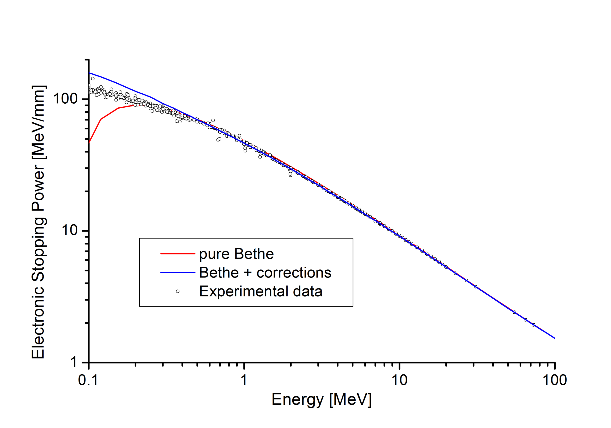

##############################################################
阻止能の計算 ( Bethe の式 ) (1)
##############################################################

=========================================================
阻止能 (Stopping power)
=========================================================

.. math::

   S = - \dfrac{dE}{dx} = S_{col} + S_{rad}

* 阻止能（線阻止能、全阻止能）は、物質中を進む荷電粒子が距離あたりにエネルギーを失う割合．
* 全阻止能は、衝突阻止能と放射阻止能として表される．

|
  
---------------------------------------------------------
衝突阻止能 ( Bethe-Blochの式 )
---------------------------------------------------------

* Bethe-Blochの式( wikipedia参照 )は、下記．

  
.. math::

   S_{col}
   &= \dfrac{ e^4 n_e }{ 4 \pi \epsilon_0^2 m_e \beta^2 c^2 } \left[ ln \left( 
      \dfrac{2 m_e \beta^2 c^2 }{ I (1-\beta^2) } \right) - \beta^2 \right] \\
   &= \dfrac{ e^4 Z \rho}{4 \pi \epsilon_0^2 m_e \beta^2 c^2 A u} \left[ ln \left( 
      \dfrac{2 m_e \beta^2 c^2 }{ I (1-\beta^2) } \right) - \beta^2 \right] 

ここで、電子密度 :math:`n_e` は、

.. math::

   n_e = \dfrac{ Z }{ A } \dfrac{ \rho }{ u }

   
Z は原子番号、Aは質量数、 :math:`\rho` は質量密度 (kg/m3)、 :math:`u=1.6605391 \times 10^{-27} \ (kg)` は原子質量単位 (amu)． ρ/u が核子数密度に相当し、Z/A との積で陽子数密度、つまりは、電子数密度に等しくなる．
   
|

---------------------------------------------------------
放射阻止能 ( Bethe-Heitlerの式？)
---------------------------------------------------------

* Bethe-Heitlerの式は、ファインマン・ダイアグラムを用いていたりと、自分の基礎学力の範疇を超えており、古典的に使用しやすい表式をみつけられていない．
* 原著の出典はわからないが、OHO2011（佐々木氏担当分）に使用できそうな表式として、下記の表式をみつけている．

.. math::

   S_{rad} = \dfrac{ N E Z (Z+1) e^4 }{ 137 m^2 c^4 }
             \left[ 4 ln \dfrac{ 2 E^2 }{ m c^2 } - \dfrac{4}{3} \right]

* おそらく、logの中身は無次元数とすべきで、分子は2E．
* 原子数密度Nを質量密度ρに変換 ( ρ= A u N とかけるはず )し、記号も上の表式と統一して下記表式が得られる． :blue:`(注意)` ．

.. math::

   S_{rad} &= \dfrac{\rho E Z (Z+1) e^4 } { 137 m_e^2 c^4 A u }
              \left[ 4 ln \dfrac{ 2 E }{ m_e c^2 } - \dfrac{4}{3} \right] \\
           &= \dfrac{ n_e E (Z+1) e^4 } { 137 m_e^2 c^4 }
              \left[ 4 ln \dfrac{ 2 E }{ m_e c^2 } - \dfrac{4}{3} \right]

|

上記の式は、単位や出典がよくわからない．

---------------------------------------------------------
衝突阻止能と放射阻止能の比
---------------------------------------------------------

有名な関係式として、

.. math::

   \dfrac{S_{rad}}{S_{col}} = \dfrac{ ( E+m_e c^2 [MeV] ) Z }{ 820 }

がある．エネルギーと電子静止エネルギーの単位はMeVを使用すること．

これを使えば、放射損失は、

.. math::

   Srad = Scol * \dfrac{ ( E+m_e c^2 [MeV] ) Z }{ 820 }

とかける．以下のプログラムではこちらを用いている．

   
=========================================================
阻止能の評価 ( proton を Al target へ )
=========================================================

---------------------------------------------------------
グラフ
---------------------------------------------------------

|

|

wikipedia に掲載されている計算結果 (Scol) とおよそ一致することを確認．

---------------------------------------------------------
プログラム
---------------------------------------------------------

|

.. literalinclude:: pyt/stoppingPowerFormula.py
   		    :language: python

---------------------------------------------------------
パラメータファイル
---------------------------------------------------------

|

.. literalinclude:: dat/parameter__p_in_Al.json
                    

