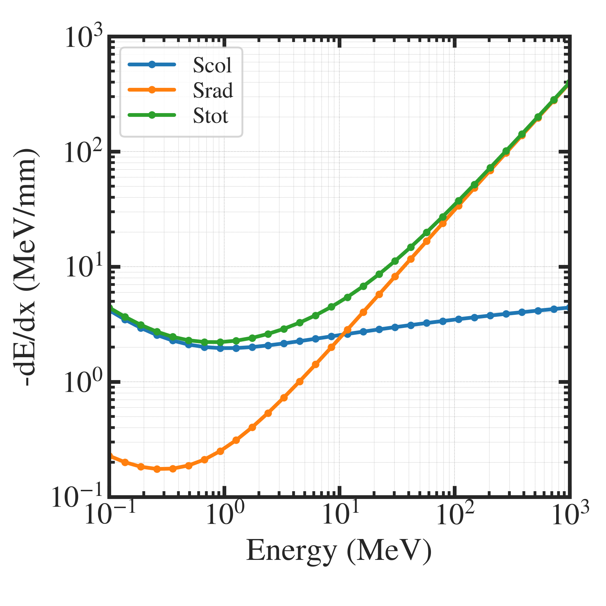
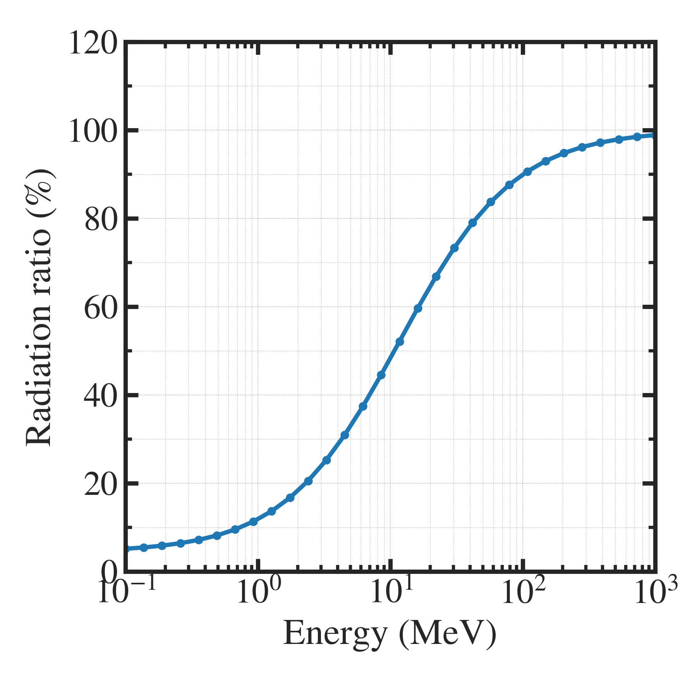

##############################################################
阻止能の計算 ( Bethe の式 ) (2)
##############################################################

=========================================================
Betheの式による類推による電子のSradの計算
=========================================================

* 入射粒子 ： 電子 (45MeV)
* ターゲット材料：タンタル

  
---------------------------------------------------------
グラフ ( 阻止能 )
---------------------------------------------------------

|

---------------------------------------------------------
グラフ ( 放射阻止能割合 )
---------------------------------------------------------

|

---------------------------------------------------------
コード
---------------------------------------------------------

* 前ページ ( 陽子をアルミに入射するコード ) と同じ．

  
---------------------------------------------------------
設定ファイル
---------------------------------------------------------

|

.. literalinclude:: dat/parameter__e_in_Ta.json
                    
