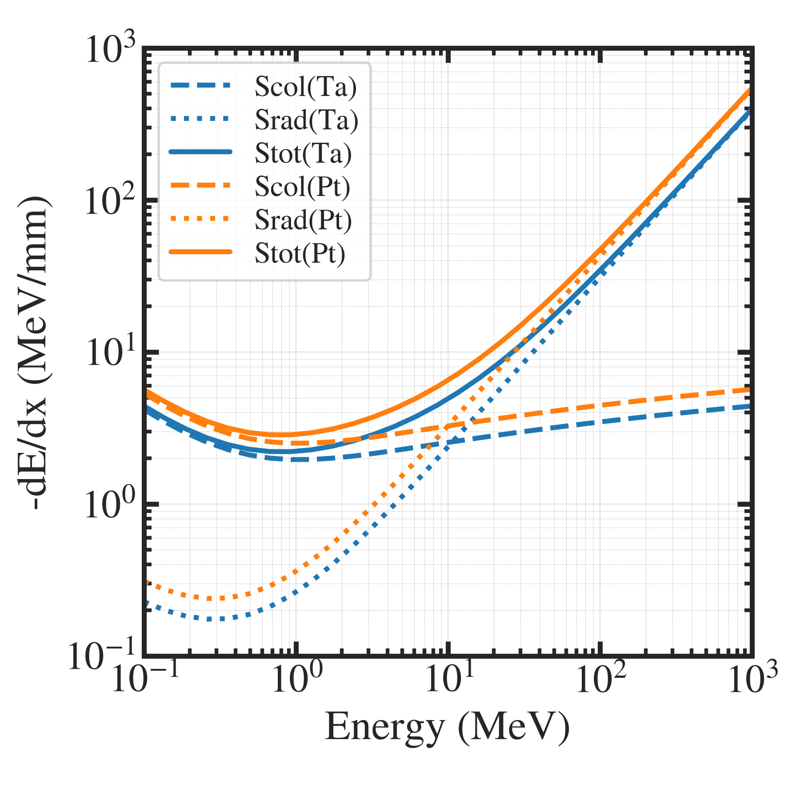
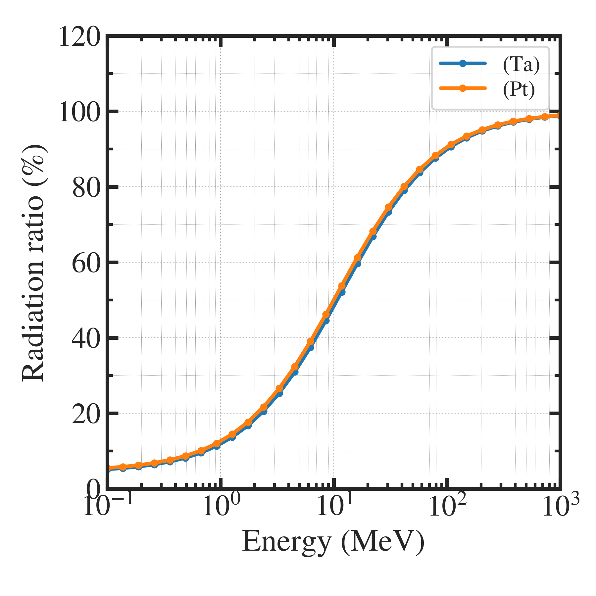

##############################################################
阻止能の計算 ( Bethe の式 ) (3)
##############################################################

=========================================================
Betheの式による類推による電子のSradの計算
=========================================================

* 入射粒子 ： 電子 (45MeV)
* ターゲット材料：タンタル, 白金の比較

  
---------------------------------------------------------
グラフ ( 阻止能 )
---------------------------------------------------------

|

---------------------------------------------------------
グラフ ( 放射阻止能割合 )
---------------------------------------------------------

|

---------------------------------------------------------
コード
---------------------------------------------------------

.. literalinclude:: pyt/compare.py
                    :language: python

                               
