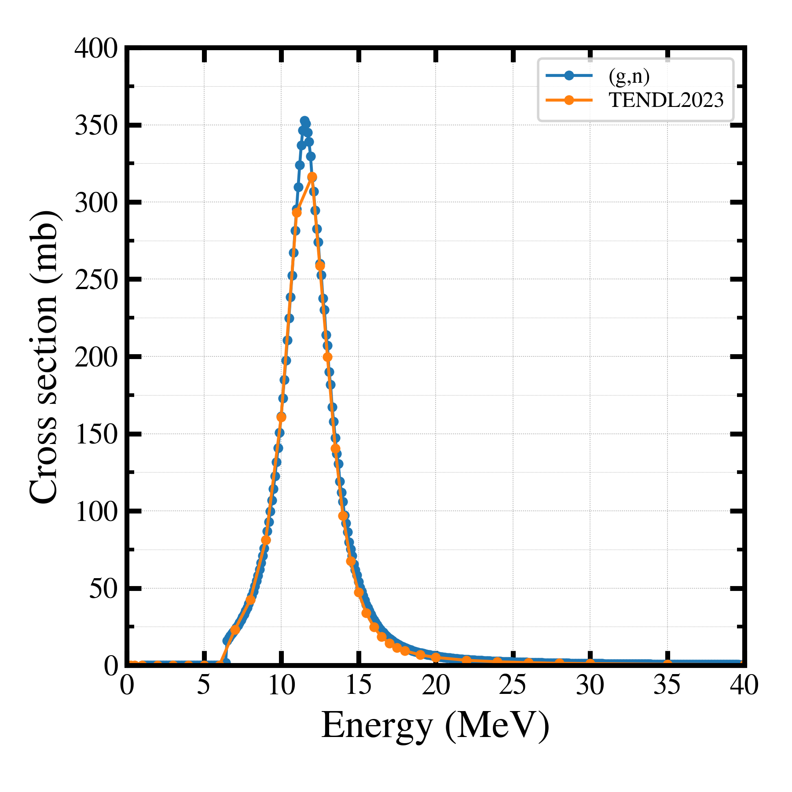
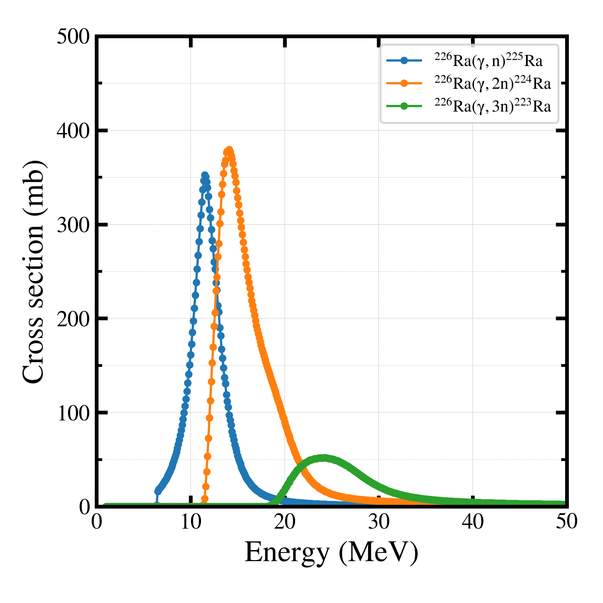
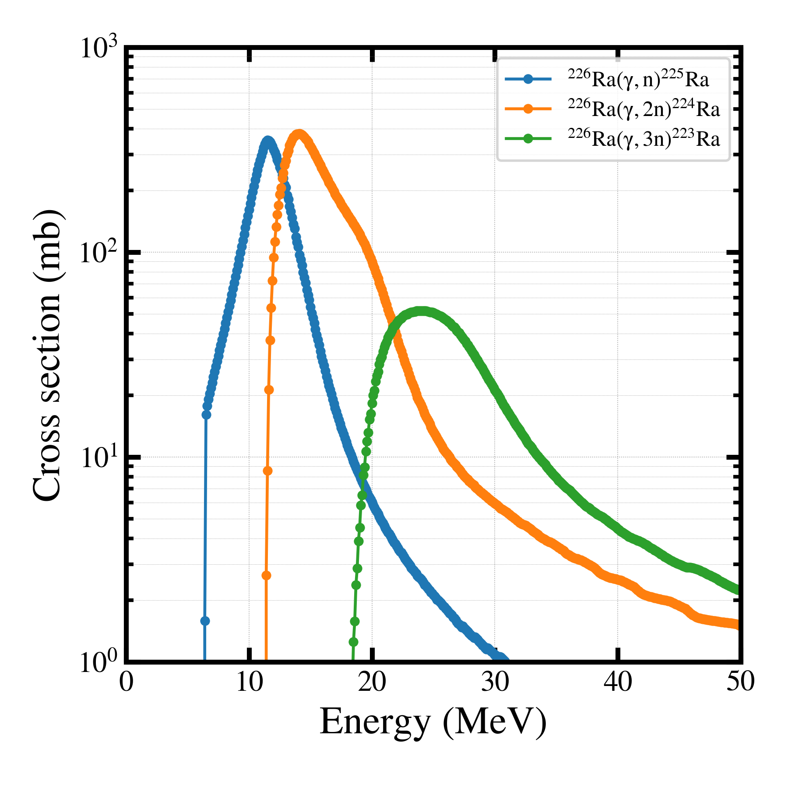

##############################################################
核反応断面積計算コード TALYS について (2)
##############################################################

=========================================================
Ra-226(g,n)Ra-225 の光核反応断面積の計算
=========================================================

---------------------------------------------------------
Ra226_gn.inp
---------------------------------------------------------

.. literalinclude:: Ra226_gn/Ra226_gn.inp

                    
---------------------------------------------------------
makefile
---------------------------------------------------------

.. literalinclude:: Ra226_gn/makefile

---------------------------------------------------------
実行命令
---------------------------------------------------------

::

   $ make

---------------------------------------------------------
実行結果
---------------------------------------------------------

.. literalinclude:: Ra226_gn/output

---------------------------------------------------------
グラフ ( TALYS & TENDL )
---------------------------------------------------------

|

|

---------------------------------------------------------
グラフ作成スクリプト ( TALYS & TENDL )
---------------------------------------------------------

.. literalinclude:: Ra226_gn/compare__tendl_talys.py
                    :language: python

                               
---------------------------------------------------------
グラフ ( (g,xn) reactions )
---------------------------------------------------------

|

|

|

---------------------------------------------------------
グラフ作成スクリプト
---------------------------------------------------------

.. literalinclude:: Ra226_gn/plot.py
   		    :language: python
