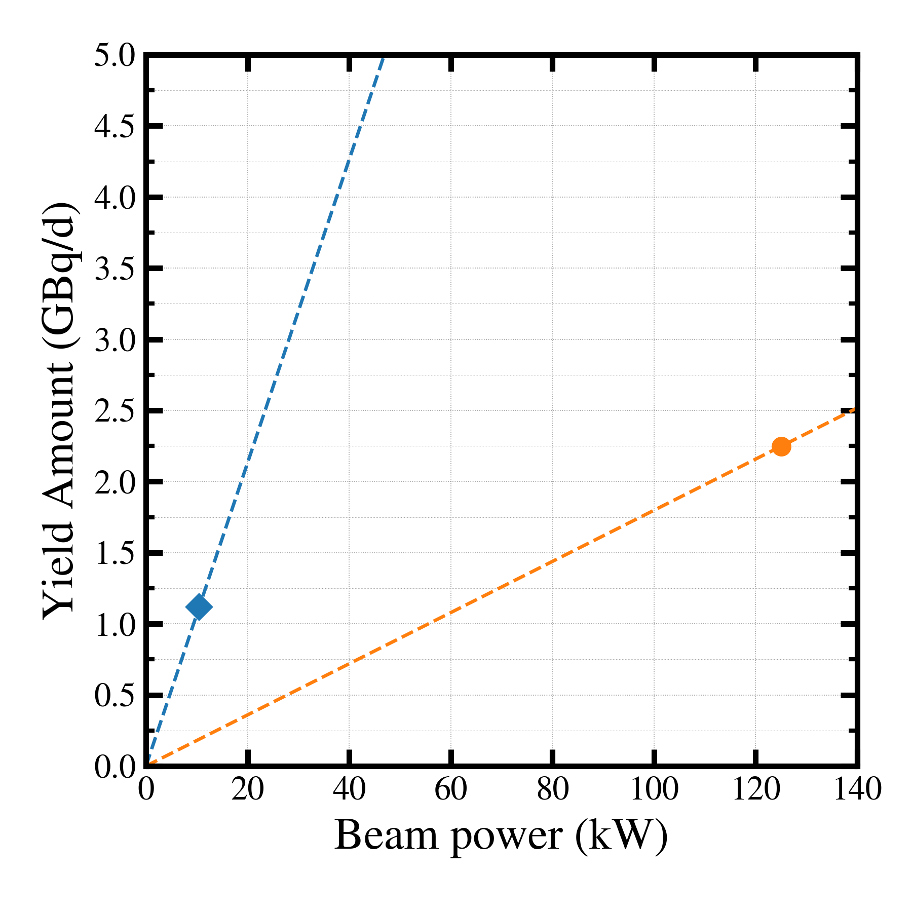

##############################################################
収率比較
##############################################################

* 複数ケースの収率を比較してみる．

---------------------------------------------------------
結果
---------------------------------------------------------

|

|

---------------------------------------------------------
プロットプログラム
---------------------------------------------------------

.. literalinclude:: code/pyt/plot__yieldrate.py
   		    :language: python

