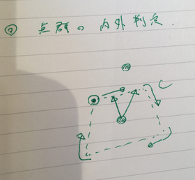

========================================================================
点群で示される２次元図形の内部にある点が含まれるかどうかを判定
========================================================================

問題と定式化
=========================================================

* とある２次元図形を点群で表現する．（曲線部分を含む図形も、点数Nを十分多く用いて直線近似で表現する．）
* 点群とは別に２次元図形と同一平面状にある点Xが与えられた時、この点が点群で示される図形の内部にあるか、外部にあるかを判定したい．
* 点群は常に右回りに図形を一周するものとする．この点群によって表される図形をC、i番目の座標位置をC[i]として表す．

  
  
判定方法
=========================================================

* 点群上で、任意の点 i1 と、半周を超えない程度に右回りに進めた別の点 i2 ( e.g. 1/10 N だけ進めた i2=i1+N/10 )を考える．
* 与えられた点Xとの2つの点群中の点 C[i1], C[i2]がつくるベクトルを考える．これら２本のベクトルがつくる外積の符号は

.. math::

   f(X) = ( C[i_1] - X ) \times ( C[i_2] - X )

である．ここで、

* :math:`f(X)<0` → Xは図形の内部
* :math:`f(X)=0` → Xは図形の線上
* :math:`f(X)>0` → Xは図形の外部

であるので、点群で示された図形に対して、ある与えられた点が内部に存在するのか外部に存在するのかを判定することができる．

