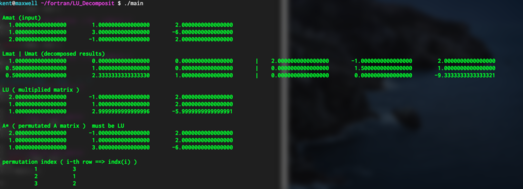

##############################################################
LU分解
##############################################################

**LU分解** ( **LU-Decomposition** ) は任意の正則行列に対して成り立つ、行列分解手法である．
行列 A が正則であるならば、

.. math::

   A = LU

と、下三角行列 :math:`L` と上三角行列 :math:`U` 積に分解することができる．これを **LU分解** と呼ぶ．

LU分解は、 *Gauss* の消去法における前進消去による上三角行列化に他ならない．行列 A と単位行列 E の拡大係数行列に対して、前進消去を適用し、上三角行列化する．

.. math::

   \begin{vmatrix}
   A_{11} & A_{12} & \cdots & A_{1n} \\
   A_{21} & A_{22} &        & A_{2n} \\
   \vdots &        & \ddots &        \\
   A_{n1} & A_{n2} &        & A_{nn}
   \end{vmatrix}

   
.. math::

   \begin{pmatrix}
   2 & 3 & \ 1 &  & 3\\
   3 & 2 &  -3 &  & 5
   \end{pmatrix}

ここで、前進消去に要した行基本変形をまとめて 行列 K と表現すれば、

.. math::

   KA = U

である．ここで、行列 K は下三角行列であり、この逆行列も下三角行列となる．両辺に K の逆行列 ( L とおく )を左からかけることにより、

.. math::

   K^{-1} K A = A = K^{-1}U = LU

と書くことができる．行列 L は下三角行列であり、行列 U は上三角行列であることから、一連の操作はAに対するLU分解である．つまり、Gaussの消去法における前進消去はLU分解に他ならないことがわかる．

=========================================================
LU分解のサンプルコード
=========================================================

LU分解のサンプルコードについて、以下に示す．

.. literalinclude:: code/main.f90
   :caption: main.f90
   :language: fortran
   :linenos:

.. literalinclude:: code/LU_DecompMod.f90
   :caption: LU_DecompMod.f90
   :language: fortran
   :linenos:

      
=========================================================
LU分解のサンプル実行結果
=========================================================

実行結果を以下に示す．まずは、LU分解単体でのテストケースについて．

1段目に入力した行列Aを表示し、2段目に行列AのLU分解結果を示している．3段目には、LU分解の確認のために、行列積LUを計算している．ここで、LU分解の際には部分ピボット選択のために行の入れ替わりが生じている．そこで、行の入れ替えを考慮した行列Aを4段目に表示しており、これがLU積と一致していることから正しくLU分解できていることがわかる．最後には、ピボット選択による入れ替え結果( indx )を示している．

次に、LU分解を用いた連立方程式の求解について検証している．上記、行列 A に対して与える左辺ベクトル b を1段目に示している．これを解くと次段に示した解が得られた．Ax、 及び、LUxを計算してやると3,4段目となり、入力した 左辺ベクトル b と一致していることがわかる．

次に、行列 A の逆行列をLU分解によって求めた結果を5段目に示す．これは、 *Gauss-Jordan* 法で解いた結果と一致しており、また、 :math:`AA^{-1}, A^{-1}A =E` を6,7段目に示した． 
