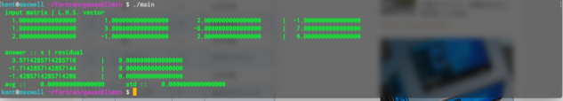

##############################################################
ガウスの消去法 ( *Gauss Elimination* )
##############################################################

ガウス ( *Gauss* ) の消去法 ( *Gauss Elimination* )は、連立一次方程式の解法の一種である． *Gauss-Jordan* 法と数学的に同値な手法なので、同一の手法として取り扱われることもあるが、 *Numerical Recipes in F77* では別節立てで紹介されており、本解説もこれに倣うことにする． ここでは、

* 全ての単位行列化を **行基本変形** により担う手法を、 **Gauss-Jordan 法**
* 上三角行列化に **前進消去** 、単位行列化に **後退代入** を用いる手法を **Gauss の消去法**

と呼ぶことにする．前進消去・後退代入は、行基本変形によって表現でき、数学的には同値な手法である．一方、同値な操作ではあるが、後退代入によって、 *Gauss* の消去法は *Gauss-Jordan* 法に比較して、計算量を定数倍程度節約できる．そのため、ここではアルゴリズムとして、別個のアルゴリズムであると考えることにする．

=========================================================
*Gauss* の消去法のアルゴリズム
=========================================================

*Gauss* の消去法にも *pivoting* ( ピボット選択 ) の 種類によって、

* 部分 *pivoting* ( *full pivoting* 行・列、いづれかの方向で pivot 探索する )
* 完全 *pivoting* ( *full pivoting* 行列両方向同時に pivot 探索する )

の2つがある．ここでは、部分 *pivoting* のアルゴリズムを例として、以下に流れを示す．

(1) 行列 A を 行列 U へコピーし、連立一次方程式の解を求める場合は右辺ベクトル、逆行列を求める場合は、右辺単位行列を用意する．
(2) i=1,2,3,...,n 行目に対して、以下の操作を繰り返す． ( **前進消去** )
    
    (i) i行目の対角要素 :math:`U_{ii}` を :math:`U_{ij}` ( j=i,i+1,...,n ) のうち、最大の値をとるものとして探索する．探索後、初期の行と異なっていれば、2つの行を交換する．
    (ii) i 行目を :math:`1/U_{ii}` 倍して、対角要素を 1 とする． 
    (iii) i行目以外の全ての j=i~n 行目に対して、 i 列目要素を 0 とする．つまり、i 行目を :math:`-U_{ji}` 倍して、j 行目へ加算する． 
(3) i=nからi=1に向けて、上三角行列Uの非対角要素をゼロにする．（ **後退代入** ）

    (i) i 行目の対角要素を、以下の式により求める．

        .. math::

           x_i = \dfrac{1}{U_{ii}} \left[ b_i - \sum^n_{j=i+1} U_{ij} x_j \right]

=========================================================
*Gauss* の消去法のサンプルコード
=========================================================

*Gauss* の消去法のサンプルコードについて、以下に示す．

.. literalinclude:: src/main.f90
   :caption: main.f90
   :language: fortran
   :linenos:

.. literalinclude:: src/gaussElimMod.f90
   :caption: gaussElimMod.f90
   :language: fortran
   :linenos:

      
=========================================================
*Gauss* の消去法のサンプル実行結果
=========================================================

実行結果を以下に示す．1段目に与えた行列 A と左辺ベクトル b を示している．2段目には、得た解 x 、及び、解の正しさを示すために、 :math:`b-Ax` とその誤差を計算している． 

