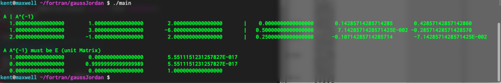

##############################################################
Gauss-Jordan 法
##############################################################

**ガウス-ジョルダン法** ( *Gauss-Jordan Method*  )は、連立1次方程式の解くためのアルゴリズムである．解くべき連立1次方程式を

.. math::
   Ax = b
   
と表す．右辺行列で表現した係数と左辺ベクトル(もしくは行列)をまとめた表式を拡大係数行列と呼ぶ．ここでの *Gauss-Jordan* 法は、拡大係数行列に対する一連の変形操作により、解を得る手法を意味する．一連の変形操作として、 **行基本変形** を用いる場合と **列基本変形** を用いる場合がある．例えば、行基本変形を用いる場合、もし行列 A が正則であれば、 :math:`A` の逆行列 :math:`A^{-1}`  を用いて、連立一次方程式は

.. math::
   x = A^{-1}b

へ変形することができる．この際に、使用する行基本変形は以下の3つである．

(1) 行列Aの i 行目と j 行目を入れ替える．
(2) 行列Aの i 行目を定数倍する．
(3) 行列Aの i 行目を j 行目に加える．

行に対する操作を列に対する操作へ置き換えると、列基本変形である．

*Gauss-Jordan* 法は、行基本変形によって方程式 :math:`Ax=b` を :math:`x=A^{-1}b` へと変形する手法であり、連立一次方程式の解法にあたる． これは、**掃き出し法** などとも呼ばれ、本質的には、中学校で習う連立方程式の解法と同じ手法である．右辺をベクトルとした拡大係数行列の場合、連立一次方程式を解くことができ、右辺を単位行列とした拡大係数行列の場合、逆行列を求めることができる．以下に、逆行列解法の数値的アルゴリズムについて解説する．

=========================================================
Gauss-Jordan法の数値的アルゴリズム
=========================================================

Gauss-Jordan法のアルゴリズムの種類として、 *pivoting* ( ピボット選択 ) の 種類によって、以下の 2つがある．

* 部分 *pivoting* ( *full pivoting* 行・列、いづれかの方向で pivot 探索する )
* 完全 *pivoting* ( *full pivoting* 行列両方向同時に pivot 探索する )

簡単のため、部分 *pivoting* のアルゴリズムに対して、以下に流れを示す．

(1) 行列 A を 行列 U へコピーし、連立一次方程式の解を求める場合は右辺ベクトル、逆行列を求める場合は、右辺単位行列を用意する．
(2) i=1,2,3,...,n 行目に対して、以下の操作を繰り返す．
    
    (i) i行目の対角要素 :math:`A_{ii}` を :math:`A_{ij}` ( j=i,i+1,...,n ) のうち、最大の値をとるものとして探索する．探索後、初期の行と異なっていれば、2つの行を交換する．
    (ii) i 行目を :math:`1/A_{ii}` 倍して、対角要素を 1 とする． 
    (iii) i行目以外の全ての j=1~n 行目に対して、 i 列目要素を 0 とする．つまり、i 行目を :math:`-A_{ji}` 倍して、j 行目へ加算する． 
(3) n 行目までに、全ての対角要素 がゼロとならずに計算できた場合、行列 A は正則行列であり、右辺行列が A の逆行列となる．
  
=========================================================
Gauss-Jordan法のサンプルコード
=========================================================

*Gauss-Jordan* 法のサンプルコードについて、以下に示す．

.. literalinclude:: src/main.f90
   :caption: main.f90
   :language: fortran
   :linenos:

.. literalinclude:: src/gausJordaMod.f90
   :caption: gausJordaMod.f90
   :language: fortran
   :linenos:

      
=========================================================
Gauss-Jordan法のサンプル実行結果
=========================================================

実行結果を以下に示す．1段目に与えた行列Aとルーチンによって得られた逆行列を示している．2段目には、得た逆行列がAの逆行列であることを示すために、 :math:`AA^{-1}=E` を計算している． 

