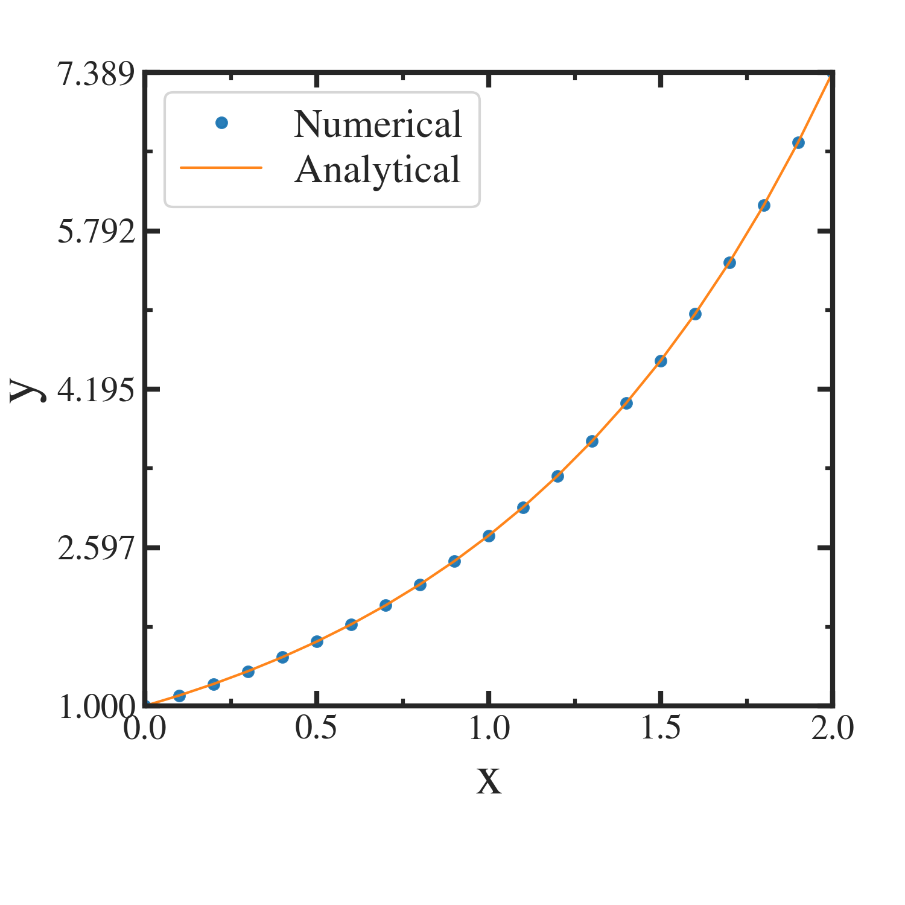

##############################################################
*Runge-Kutta* 法
##############################################################

*Runge-Kutta* 法 ( *Runge-Kutta* Method ) は代表的な常微分方程式の数値解法である．
予測子・修正子法 ( predictor-Corrector Method )を用いて，高精度かつロバストに数値積分可能である．
*Runge-Kutta* 法には，段数，精度，係数を任意に設定することができるため，一般に呼ばれる場合，大体4次精度の古典的手法を指すことが多い．

=========================================================
数値解法
=========================================================

次の常微分方程式を解くことを考える．

.. math::
   y' = f(x,y)

初期値を :math:`x=x_0` において :math:`y=y_0` とする．微小区間 :math:`\Delta x` によって離散化すれば，常微分方程式の数値積分解を次の式から得ることができる ( 4th-order *Runge-Kutta* Method )．

.. math::
   x_{n+1} &= x_{n} + \Delta x \\
   y_{n+1} &= y_{n} + \dfrac{\Delta x}{6} [ k_1 + 2k_2 + 2k_3 + k_4 ]

ここで，係数 :math:`k_n` は以下の式から得る．

.. math::
   k_1 &= f( x_n                    , y_n ) \\
   k_2 &= f( x_n+\dfrac{\Delta x}{2}, y_n + \dfrac{\Delta x}{2} k_1 ) \\
   k_2 &= f( x_n+\dfrac{\Delta x}{2}, y_n + \dfrac{\Delta x}{2} k_2 ) \\
   k_2 &= f( x_n+\Delta x           , y_n + \Delta x            k_3 )

=========================================================
実装
=========================================================

Fortran90で実装した．
前提として，微分方程式の被数値積分対象である右辺 :math:`f(x,y)` は解析的に得られるとする．
ここで， :math:`x` の離散化の間隔は任意としている．大した計算負荷ではないが， :math:`\Delta x` の計算は等間隔であれば主 *Runge-Kutta* ループ外部へ出すことができる． 

まず，メインルーチンを示す．ここでは，x, yを離散化，初期化して，初期値 :math:`y(x_0)=y_0` を代入する． *Runge-Kutta* ソルバーを呼び出し，数値積分した後，画面及びファイルへ出力する．

.. literalinclude:: code/main.f90
   :language: fortran

次に， *Runge-Kutta* ソルバーのモジュールを示す．
区間 :math:`\Delta x` における :math:`k_1, k_2, k_3, k_4` を求め，:math:`y_n \rightarrow y_{n+1}` の数値積分を反復するルーチンと，右辺を計算する関数がある．

.. literalinclude:: code/RKGMethodMod.f90
   :language: fortran

=========================================================
数値解析例
=========================================================

簡単な例として， :math:`y'=y` の微分方程式を初期値 :math:`y(x=0)=1` のもとで解くことを考える．
解析的には，

.. math::
   y = e^x

が解となる．

解析解と数値解析結果を図に示す．分解能が粗くても，良い精度で一致していることがわかる．

