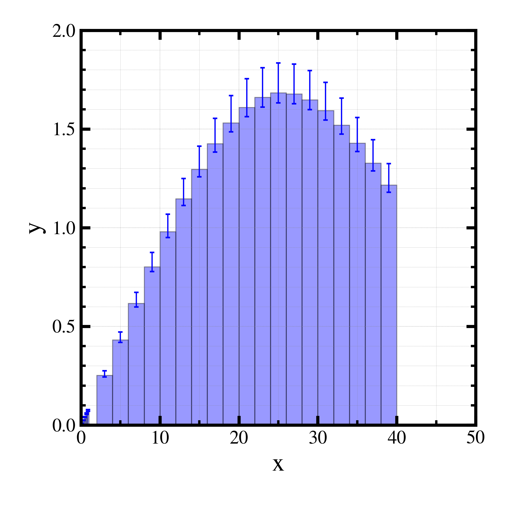

##############################################################
gplot1D.py (1) ヒストグラム (バー)
##############################################################

* gplot1D.py にて、add__bar() 中で、  :red:`xMin, xMaxで、横方向のレンジを記載` すればよい．
* PHITS等のエネルギースペクトラムの表示に使用可能．
* errorbar の指定は、

  +  :blue:`(nData,)の配列` （上下等間隔）、または、
  +  :blue:`(2,nData)の配列` （上下のエラー範囲）

=========================================================
グラフ
=========================================================

|

|

=========================================================
コード
=========================================================

.. literalinclude:: codes/gplot1d__p1_01.py
   		    :language: python
   		    :emphasize-lines: 44-47
