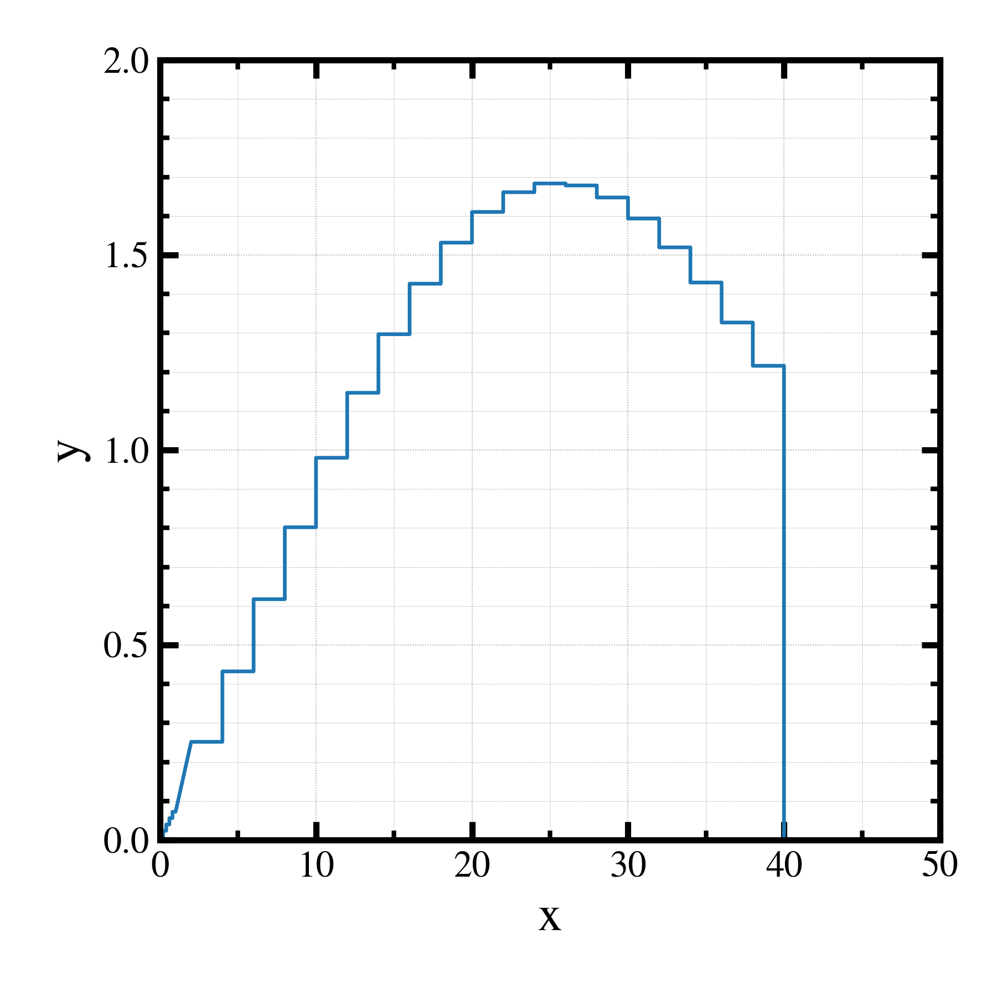

##############################################################
gplot1D.py (2) ヒストグラム (ステップ)
##############################################################

* ヒストグラムを書くが、バー（棒グラフ）でなく、ステップでプロットするためのデータ変換
* 以下の手順で作成可能．

  + データレンジ（xMin, xMax）を連結（２次元に連結⇒１次元になおす）
  + y値のデータを２回繰り返す．
  + 端処理： y値=0 、x値=両端の値をコピー

=========================================================
グラフ
=========================================================

|

|

=========================================================
コード
=========================================================

.. literalinclude:: codes/gplot1d__p1_02.py
   		    :language: python
   		    :emphasize-lines: 26-31,52
