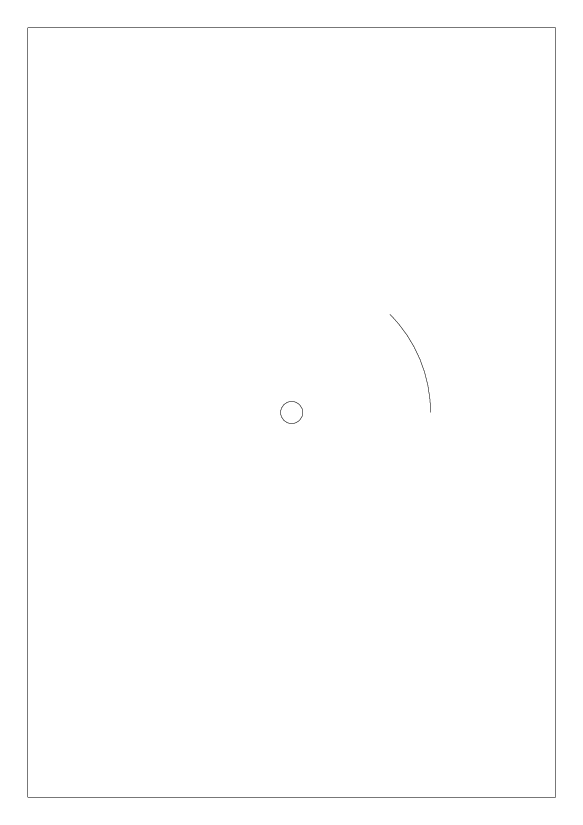

##############################################################
page 設定と基本的な使用方法について
##############################################################

=========================================================
page設定について
=========================================================

.. note::

   "reportlabのデフォルトの単位系はポイント（point）である．1ポイントは約1/72インチ（約0.3527ミリメートル）に相当する．ポイントは、印刷業界で一般的に使用される単位．ミリメートルなどで使用するには変換が必要となる．"

=========================================================
基本サンプルコード
=========================================================

基本サンプルコードは下記．

.. literalinclude:: ../../code/reportlab/basic_sample.py
   :caption:  repotlabの基本サンプルコード ( page設定と図形描画 )
   :language: python
                               

=========================================================
出力PDFファイル
=========================================================

図形としては下記．

           
PDFとしては下記．

:download:`pdf <../../image/reportlab/basic_sample.pdf>`
