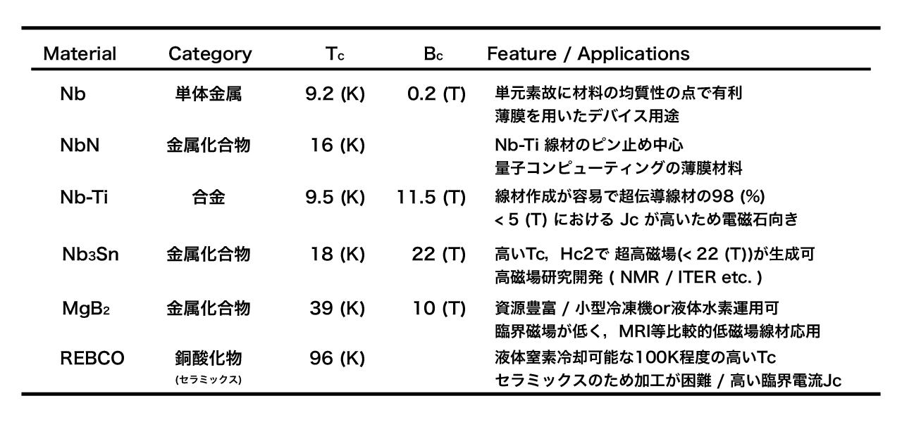

##############################################################
超伝導材料について
##############################################################

=========================================================
超伝導材料として有用な特性
=========================================================

単体元素，合金，酸化物，セラミックス等，多くの物質が超伝導相転移することが明らかになっている．
数多く存在する超伝導材料のうち，工学的に用いられる材料に要求される性能を，以下に列挙する．

* 臨界温度 ( :math:`T_c` ) が高い．
* 上部臨界磁場 ( :math:`H_{c2}` ) が高い．
* 臨界電流密度 ( :math:`J_c` ) が高い．
* 生産性が高く，コストが安い．
* 化学的・機械的に安定で加工しやすい．

上３つは超伝導特性であるが，超伝導電磁石や線材として要求される性能を満たせば十分である．
一方，下２つが工学的応用の容易性を左右し，現在ではこれらが超伝導材料としての決定因子となりやすい．

=========================================================
実用されている超伝導材料
=========================================================

主な超伝導材料として以下が挙げられる．

      
