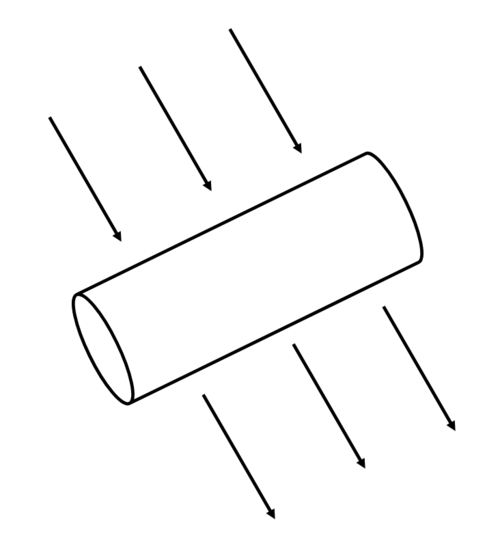
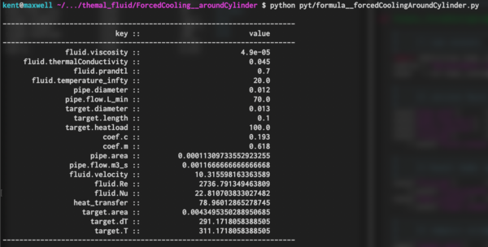

##############################################################
円筒物体周りの流れによる強制空冷について ( その１ )
##############################################################

図のような体系を考える．

円筒形状の物体（冷却対象）に直行して流体（水、空気、etc.）が流れて強制対流によって冷却される．
この場合の熱伝達率、及び、冷却対象の定常状態の温度を考える．
内容については文献[1]を参考にしている．

=========================================================
基本式
=========================================================

以下に計算に用いる基本式を示す．

---------------------------------------------------------
Reynolds数の計算
---------------------------------------------------------

直径Dの円筒まわりの流れに対するReynold数を計算する．

.. math::

   Re_D = \dfrac{ \rho U D }{ \mu } = \dfrac{ UD }{ \nu }

ここで、もちろん、Uは流速 [m/s], Dは円筒の直径 [m]、 :math:`\rho` は流体の密度 [kg/m3]、 :math:`\mu` は粘性率 [Pa s] であり、 :math:`\nu` は動粘度 [m2/s] である．

---------------------------------------------------------
Nusselt数の計算
---------------------------------------------------------

Nusselt数 Nu は、Hilpert-Kundsen-Katzの式より、

.. math::

   Nu = \dfrac{ h D }{ \lambda } = C Re_D^m Pr^{1/3}

ここで、熱伝達率 h [W/m2K], 熱伝導度 :math:`\lambda` 、プラントル数 Pr を用いている．
また、使用している係数 C, m は参考文献[1][2][3] より見つけることができる．

たとえば、以下である．

.. csv-table:: **Coefficients of Hilpert-Kundsen-Katz formula**
   :header: "Re", "C", "m"
   :widths: 30, 15, 15
   :width:  800px
   
   "0.4-4", "0.989", "0.330"
   "4-40", "0.911", "0.385"
   "40-4000", "683", "466"
   "4000-40000", "0.193", "0.618"
   "40000-400000", "0.027", "0.805"

            
---------------------------------------------------------
熱伝達率の計算
---------------------------------------------------------

熱伝達率は、Nusselt数より求めることができる．

.. math::

   h = \dfrac{ Nu \lambda }{ D }

---------------------------------------------------------
温度の計算
---------------------------------------------------------

Newtonの冷却法則より、求めることができる．

.. math::

   \dot{ Q }_{conv} = hA ( T - T_{\infty} )

   
変形すれば、陽に、冷却対象の温度として、次が導ける．
   
.. math::
   
   T = T_{\infty} + \dfrac{ \dot{ Q }_{conv} }{ hA }
   

=========================================================
計算例（シンプル）
=========================================================

物性値は温度依存性をもつ．
そのため、一度の冷却対象の温度の算出で、系の定常状態は決定されない．
一方、initial guess として、また、計算手法を記す目的で、反復をしない計算例を以下に挙げる．
例えば、流速 U=10 m/s, 円筒の直径 D=15 mm、を空気で冷やすことを考えれば、Reynolds数は

.. math::

   Re_D = \dfrac{ 10 \times 15 \times 10^{-3} }{ 1.5 \times 10^{-5} } = 10000

Nusselt数は、空気のPrandtl数 0.7 、及び、係数 C=0.193, m=0.618 を用いて、

.. math::

   Nu = 0.193 \times ( 10^4 )^{0.618} \times 0.7^{1/3} = 50.8
   
これより、熱伝達率は、

.. math::

   h = \dfrac{ 50.8 \times 0.025 }{ 15 \times 10^{-3} } = 84.6 \mathrm{[W/m^2K]}

無限遠での空気の温度を 25 ℃として、発熱量を 100 W, 円筒長さが 100 mmとすれば、表面積Aはおよそ A=0.005 であるので、

.. math::

   T = 25 + \dfrac{ 100 }{ 84.6 \times 0.005 } = 25 + 236.4 = 261.4 [C]

=========================================================
シンプル計算用のスクリプト
=========================================================

---------------------------------------------------------
スクリプト
---------------------------------------------------------

上記計算を実行するスクリプトは以下である．

.. literalinclude:: ../code/forcedCoolingAroundCylinder/formula__forcedCoolingAroundCylinder.py
   		    :caption:  formula__forcedCoolingAroundCylinder.py
   		    :language: python

parameter.confで計算条件を与える．

---------------------------------------------------------
実行結果
---------------------------------------------------------

実行結果は例えば、以下．

                               
   
=========================================================
Reference
=========================================================

[1] 小山敏行, 例題で学ぶ伝熱工学, 森北出版, 2012
[2] R.Helpert Warmeabgabe von geheizen Drahten und Rohren, Forsch. Geb Ingenieurwes vol.4, 1933
[3] J.D. Kundsen, D.L.Katz Fluid Dynamics and Heat Transfer, McGraw-Hill, 1958
