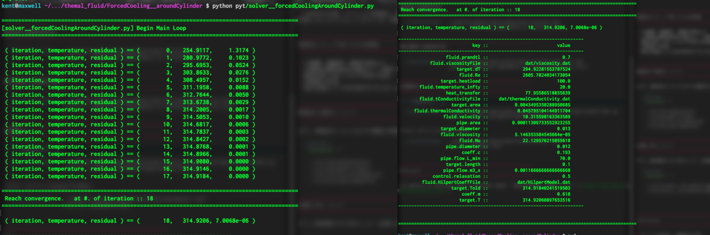

##############################################################
円筒物体周りの流れによる強制空冷について ( その２ )
##############################################################

その１では、温度を仮定した１回の計算での算出について記載した．
温度が上昇する毎に、空気の物性値（動粘度、熱伝導度、密度、等）が変化するため、非線形的に解く必要がある．

=========================================================
物性値の変化
=========================================================

---------------------------------------------------------
取り扱う変化
---------------------------------------------------------

* 動粘度 :math:`\nu`
* 熱伝導度 :math:`\lambda`

.. note::

   厳密には、Prandtl数も変化するが、Prandtl数の温度依存性は大きくない[1]ので、ここでは無視する．

   
---------------------------------------------------------
動粘度の温度依存性
---------------------------------------------------------

.. literalinclude:: ../code/forcedCoolingAroundCylinder/viscosity.dat
   		    :caption: Temperature dependence of viscosity (Air).

---------------------------------------------------------
熱伝導度の温度依存性
---------------------------------------------------------

.. literalinclude:: ../code/forcedCoolingAroundCylinder/thermalConductivity.dat
   		    :caption: Temperature dependence of thermalConductivity (Air).

=========================================================
反復解法コード
=========================================================

---------------------------------------------------------
コード
---------------------------------------------------------

.. literalinclude:: ../code/forcedCoolingAroundCylinder/solver__forcedCoolingAroundCylinder.py
   		    :caption: solver__forcedCoolingAroundCylinder.py

---------------------------------------------------------
パラメータファイル
---------------------------------------------------------
                              
.. literalinclude:: ../code/forcedCoolingAroundCylinder/parameter.conf
   		    :caption: parameter.conf

---------------------------------------------------------
実行結果
---------------------------------------------------------
                              

=========================================================
Reference
=========================================================

[1] Website of BUILDING PHYSICS RESEARCH GROUP, "空気の物性値（温度による）" ( https://lee-lab.net/blog-contents-037/ )
