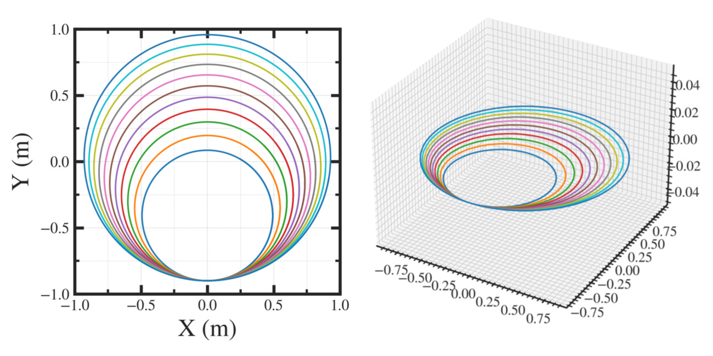

##############################################################
ポスト処理の実行
##############################################################

=========================================================
粒子の選択 ( select__particles.py )
=========================================================

* 解析対象の粒子を選択する．
* dat/selected.dat を作成する．解析プログラムは、ここに記されている粒子番号を参照するようにする．
* select__particles.py 内に load__selcted() があり、これを呼べば、粒子番号を( 1始まりの np.int64の Array ) として得ることができる．

  
.. code-block:: python

   import select__particles as sel
   selected  = sel.load__selected()

   
* dat/selected.dat の作成モードとしては、 以下がある．
  
  + 全粒子を拾う ( --mode all )
  + 配列の引数として与える ( --mode (array/choose) --array 1,2,3 etc. )
  + 配列で dat/parameter.conf に書いてあるものを使う ( --mode (array/choose) )
  + select__particles.py の内部の関数 ( judge__particles() )に記述した条件で選択する． ( --mode judge )

.. code-block:: shell

   $ python pyt/select__particles.py --mode all
   $ python pyt/select__particles.py --mode array --array 1,2,3
   $ python pyt/select__particles.py --mode array
       # ( dat/parameter.conf に post.select.pt.array を記載 )
   $ python pyt/select__particles.py --mode judge
    

=========================================================
軌道の描画 ( display__trajectory.py )
=========================================================

* 平面内、３次元空間内での軌道を描画する．
* 描画する粒子は select__particles.py で選択する．
* 空間一様磁場（z方向）、y=-0.8から出発した 70-230 MeV の陽子の軌道は以下（陽子だけどマイクロトロン）．

.. code-block:: shell

   $ python pyt/display__trajectory.py

   
