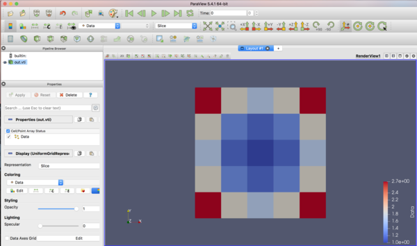

=========================================================
ImageDataの記述
=========================================================

ImageDataの例
======================================

VTKにおいて，与えられたデータをImageDataとして記述してみる．
ImageDataのサンプルは次のようになる．

.. code-block:: xml

   <?xml version="1.0"?>
     <VTKFile type="ImageData">
       <ImageData WholeExtent="0 4 0 4 0 0" Origin="0.0 0.0 0.0" Spacing="1.0 1.0 1.0">
         <Piece Extent="0 4 0 4 0 0">
           <PointData Scalars="Data1">
	     <DataArray type="Float64" NumberOfComponents="1" Name="Data1" format="ascii">
	       2.718 1.868 1.648 1.868 2.718
	       1.868 1.284 1.133 1.284 1.868
	       1.648 1.133 1.0   1.133 1.648
	       1.868 1.284 1.133 1.284 1.868
	       2.718 1.868 1.648 1.868 2.718
	     </DataArray>
           </PointData>
         </Piece>
     </ImageData>
   </VTKFile>

   
Paraviewを用いた表示結果は以下の通り．
   

ImageData出力用クラス
======================================

Python上のnumpy配列データを引数として渡し， データセット要素 ImageData のXML形式VTKファイル(.vti) を出力するクラスを以下に示す．

.. literalinclude:: code/makeImageData.py
   :language: python
   
