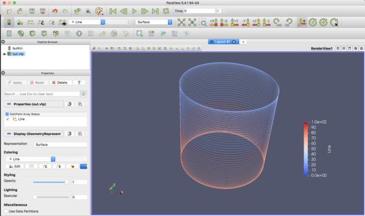

=========================================================
PolyDataの記述：線分
=========================================================

VTKにおいて線分情報をPolyDataを用いて記述してみる．
データセット要素 PolyData のうち，PointsとLinesを用いて幾何形状を形成し，Schalar Data をのせる．
例として，

.. math::
   \begin{cases}
   x &= \cos( 2 \pi t        ) \\
   y &= \sin( 2 \pi t        ) \ \ ( \ 0 \le t \le 100 \ ) \\
   z &= \sin( 2 \pi t * 0.01 )
   \end{cases}

で表される螺旋を描く．

PolyData (Line) の例
======================================

PolyDataデータセット要素を用いて3次元空間内で線分を表現できる．
PolyDataを用いた記述例を以下に示す．

.. literalinclude:: code/polyDataLine_sample.vtp
   :language: xml

線分データの記述様式
======================================

線分をPolyDataを用いて書く場合，<Points> と <Lines> タグを用いて，線分を表現する．
<PolyData>タグ内( <PolyData> <Piece> ... </Piece> </PolyData> )の構成要素は，

* **<PointData>... </PointData>** ( 線分にのせるスカラー情報 : [nData] )
* **<Points>...</Points>** ( 線分を構成する **点群** : [nData,NumberOfComponents=3] )
* **<Lines>...</Lines>** ( 線分の **接続情報** ． **connectivity / offsets により構成** )

  + <DataArray **Name="connectivity"** >...</DataArray> ( 各データ間の **連結** (0,1), (1,2), ... )
  + <DataArray **Name="offsets"** >...</DataArray> ( 各構成要素データの **終点** を示す 2 4 6 8 ... )

Paraviewによる表示例
======================================

Paraviewによる **3次元描画例** を示す．

PolyData(Line) 作成用クラス
======================================

PolyDataを用いて，線分を記述するためのクラス,  **vtk_makePolyData_line** を以下に示す．

入出力
----------------

.. code-block::
   :emphasize-lines: 1

   vtk_makePolyData_line( vtkFile=None, Data=None, xyz=None, VectorData=False, DataFormat="ascii" )

* vtkFile    = ( default : out.vtp )
* Data       = [ NoPoints, NoLines ]
* xyz        = [ NoPoints, NoCoords(3), NoLines ]
* VectorData = True or False ( default : False )
* DataFormat = ( default : "ascii" )

  
コード
----------------

.. literalinclude:: code/makePolyData_line.py
   :language: python

              
