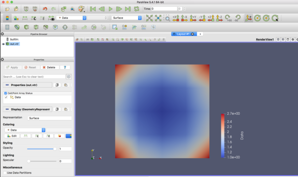

=========================================================
RectilinearGridの記述
=========================================================

RectilinearGrid の例
======================================

xml形式のデータファイルは以下の通り．

.. literalinclude:: code/rectGrid_sample.vtr
   :language: xml

        
RectilinearGrid 出力用クラス
======================================

* 以下の引数をとる．

  + Data= [LI,LJ,LK]
  + xAxis= [LI], yAxis= [LJ], zAxis=[LK]  or  Axis={"xAxis":xAxis,"yAxis":yAxis,"zAxis":zAxis}
  + VectorData= *True* or *False*
  + vtkFile= *FileName*

    
.. literalinclude:: code/makeRectilinearGrid.py
   :language: python
