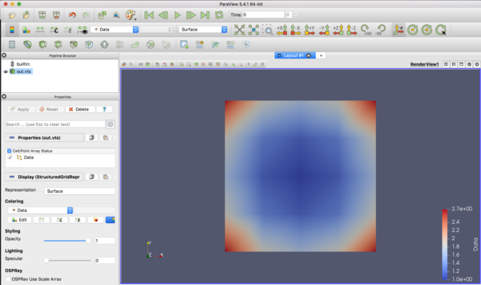

=========================================================
StructuredGridの記述
=========================================================

StructuredGrid の例
======================================

xml形式のデータファイルは以下の通り．

.. literalinclude:: code/strcGrid_sample.vts
   :language: xml

        
StructuredGrid 出力用クラス
======================================

* 以下の引数をとる．

  + Data= [LI*LJ*LK]
  + xAxis= [LI], yAxis= [LJ], zAxis=[LK]  or  Axis=[LI*LJ*LK,3]
  + VectorData= *True* or *False*
  + vtkFile= *FileName*
  
    
.. literalinclude:: code/makeStructuredGrid.py
   :language: python
